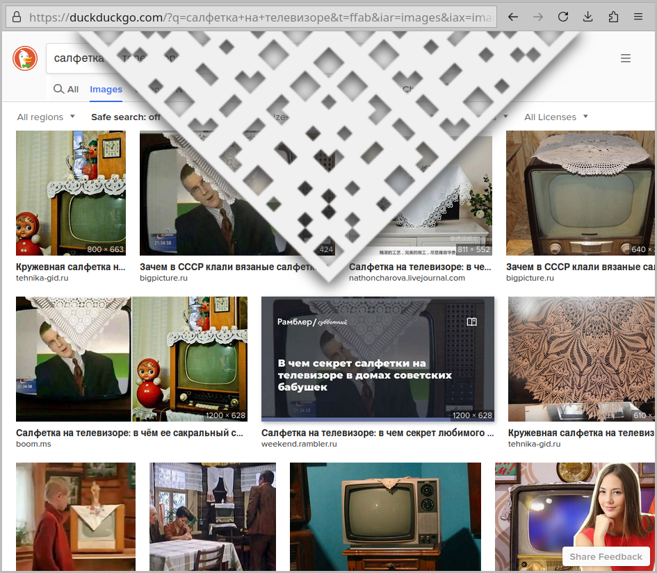

# Browser Milje 2077

Adds a milje tablecloth on top of your browser viewport,
bringing a classic piece of Slavic home decor
straight to your screen.

Now with the questionable aesthetics of a QR code!

This is a friendly tribute
to the awesome [miljegen](https://github.com/miljegen/browser-milje) project.

## How It Looks Like

## Manual Installation

You can load the unpacked WebExtension in your favorite browser.

### Firefox

Open the `about:debugging#/runtime/this-firefox` page
and click the `Load Temporary Add-on...` button.

Tested on Firefox 129.

### Chromium-based

Open the `chrome://extensions` page,
toggle the `Developer mode`
and click the `Load unpacked` button.

Tested on Google Chrome 127.
